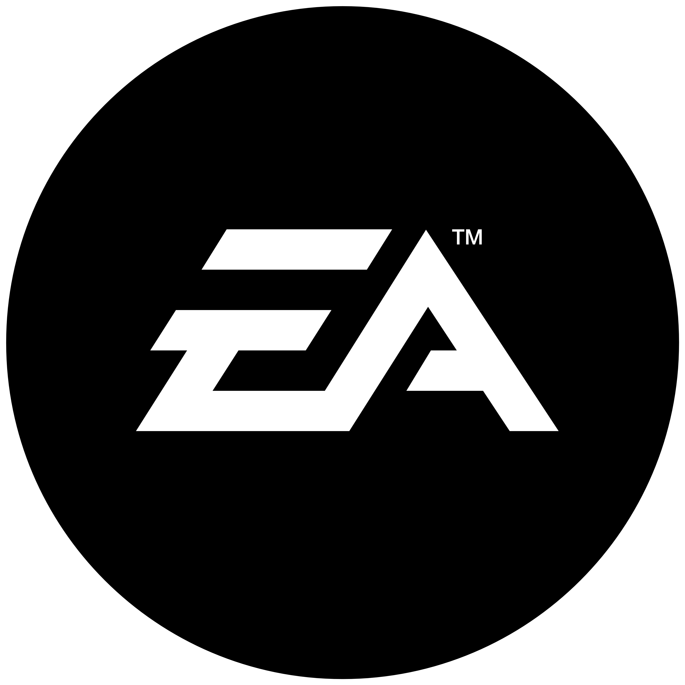
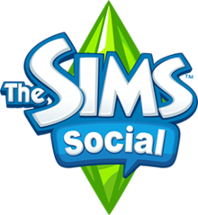
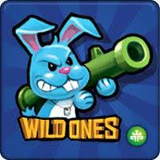
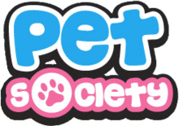

   
  
   
  Electronic Arts Inc. is an American video game company headquartered in Redwood City, California. It is the second-largest gaming company in the Americas and Europe by revenue and market capitalization after Activision Blizzard and ahead of Take-Two Interactive and Ubisoft as of March 2018.
   
   

# EA's Deprecated GAMES LIST-

 

<b>The Sims Social-</b> was a Facebook addition to the Sims series of video games. It was announced during the Electronic Entertainment Expo 2011 press conference. As with the original Sims games, The Sims Social lets the user create their own customizable character. In this version, however, the player uses their character to interact with those of their Facebook friends. The characters can develop likes or dislikes for other Sims, creating relationships that can be publicized on the user's Facebook page.
 
  
 

<b>Wild Ones-</b> Most of you have probably heard of Facebook,Myspaceand Google+ Well you might have also heard that Facebook and Myspace have multiplayer games. Wild ones was one of them. Wild Ones was a multiplayer turn based shooting game which was based on 'Worms'. You will start the game with a dog and as you continue throughout the game you have the option to get a rabbit, panda, monkey, cat, armadillo, chameleon, bat, hamster and many other Pets. There were also the 10 maps to play on and a bunch of weapons to use.
 
  
 

<b>Pet Society-</b> was a social-network game developed by Playfish that could be played on Facebook. The game ranked as one of the most popular Facebook applications. Players could design their pets by choosing genders, names, colors and altering appearances.
 

# How much did these game make?🤔-

<b>Pet Society-</b> The game was launched August 8, 2008 by Playfish and at its "peak had 50 million monthly players, 5 million daily players and made as much as <b>$100,000</b> a day by selling in-game items.
 
<b>The Sims Social-</b>"peak had 64 million monthly players, 6.4 million daily players and made as much as <b>$190,000</b> a day by selling in-game items..
 
<b>The Sims Social-</b>"peak had 30 million monthly players, 3 million daily players and made as much as <b>$80,000</b> a day by selling in-game items..
 

 
THAT IS <b>$370,000(2,62,81,359.00 Indian Rupee)</b> a day!!!!!
 

 

# EA shuts down "older" Facebook games
 
EA has announced its intention to shut down Facebook games The Sims Social, SimCity Social and Pet Society.

EA said it took the "difficult decision" to "retire" what it described as its "older" Facebook games after witnessing the number of players and amount of activity for each title decrease. "For people who have seen other recent shutdowns of social games, perhaps this is not surprising," EA said in a statement.

These games, all made by the EA-owned social developer PlayFish, will go offline on 14th June. In the case of SimCity Social, it won't make it to a year online - that game launched on 25th June 2012. The Sims Social released on 9th August 2011. Pet Society launched on 8th August 2008.

EA offered more detailed statements on each title - they're all the same, but with the name of the game in question swapped in.

On The Sims Social, it said: "We had to make the difficult decision to close down The Sims Social so we can reallocate development resources to other titles that we hope you'll have just as much fun playing. We hope you have gotten many hours of enjoyment out of the games and we thank you for everything you've added to the community."

The Sims Social hit the headlines last year when EA accused The Ville, run by bitter social game rival Zynga, of ripping it off. The two companies eventually settled the dispute out of court.

Players of these games have reacted to the news in anger. Naomi Szwed, from Australia, wrote on Facebook of SimCity Social's closure: "I only play ONE game on Facebook. and this is it! It is the ONLY GAME I PLAY. You really know how to make customers happy. I will boycott anything EA if you remove this. Sorry."

Reacting to the closure of The Sims Social, "patty.switzer.1" wrote on the Playfish forum: "As of now I will not be playing Sims anymore. I would like to be reimbursed for the remaining 92 Sims Cash. My reasons for leaving now is I will not put anymore money, time or effort into playing a game that is ending."

EA said it will continue to deliver popular titles for Facebook, and pointed to PopCap games Bejeweled Blitz, Solitaire Blitz and Plants vs. Zombies Adventures.

It vowed to make a special offer to introduce those who have played the games being taken offline to PopCap games. "You're a valued fan and we want to make sure you get a smooth transition to PopCap," EA said.
